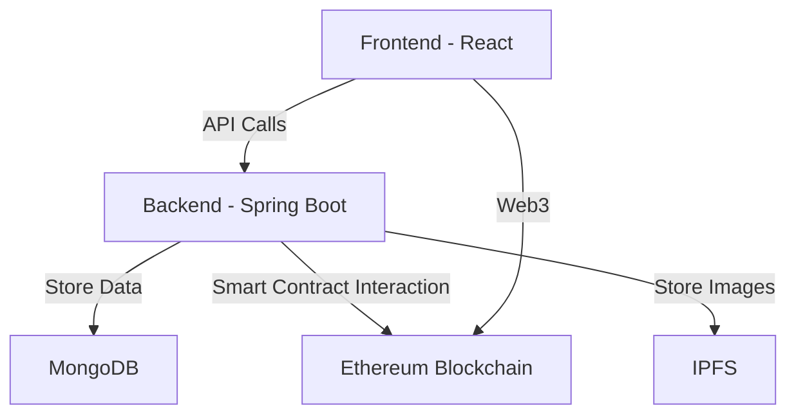

# 🚗 Decentralized Car Rental System

<div align="center">


[](https://spring.io/projects/spring-boot)
[](https://reactjs.org/)
[](https://ethereum.org/)
[](https://web3js.readthedocs.io/)
[](https://www.mongodb.com/)

A modern, secure, and decentralized car rental platform built on Ethereum blockchain.

</div>

## 🌟 Features

- **🔐 Secure Authentication**
  - Web3 wallet integration (MetaMask)
  - JWT-based session management
  - Role-based access control (RBAC)

- **🚙 Car Management**
  - Register cars on blockchain
  - Upload car details and images to IPFS
  - Real-time GPS tracking
  - Comprehensive car search and filters

- **💰 Smart Payments**
  - Ethereum-based transactions
  - Automatic payment processing
  - Complete payment history
  - Rental deposit management

- **📱 User Experience**
  - Responsive Material-UI design
  - Real-time notifications
  - Interactive car location tracking
  - Intuitive rental management

## 🏗️ Architecture



## 🛠️ Tech Stack

### Backend
- **Framework:** Spring Boot 3.x
- **Security:** Spring Security, JWT
- **Blockchain:** Web3j, Ethereum
- **Database:** MongoDB
- **Build Tool:** Maven

### Frontend
- **Framework:** React 18
- **UI Library:** Material-UI v5
- **Web3:** Web3-React
- **State Management:** React Context
- **HTTP Client:** Axios

### Blockchain
- **Network:** Ethereum
- **Smart Contracts:** Solidity
- **Development:** Truffle/Hardhat
- **Client:** Web3j

## 🚀 Getting Started

### Prerequisites
- Java 17+
- Node.js 16+
- MongoDB
- Ethereum Wallet (MetaMask)
- Ganache (for local blockchain)

### Backend Setup
```bash
# Clone the repository
git clone https://github.com/yashodhan271/car-rental-dapp.git

# Navigate to backend directory
cd car-rental-dapp

# Install dependencies
mvn clean install

# Run the application
mvn spring-boot:run
```

### Frontend Setup
```bash
# Navigate to frontend directory
cd frontend

# Install dependencies
npm install

# Start the development server
npm start
```

### Smart Contract Deployment
```bash
# Deploy contracts
truffle migrate --network development

# Update contract addresses
Update application.yml with new contract addresses
```

## 🔒 Security Features

- **Wallet Authentication**
  - Nonce-based signature verification
  - Secure session management

- **Data Protection**
  - Encrypted data storage
  - Secure API endpoints
  - CORS protection

- **Smart Contract Security**
  - Access control modifiers
  - Reentrancy protection
  - Emergency pause functionality


## 🤝 Contributing

We welcome contributions! Please see our [Contributing Guidelines](CONTRIBUTING.md) for details.

## 📄 License

This project is licensed under the MIT License - see the [LICENSE](LICENSE) file for details.

## 🙏 Acknowledgments

- OpenZeppelin for smart contract libraries
- Material-UI team for the amazing UI components
- Web3j community for Ethereum integration tools


---

<div align="center">

Made with ❤️ by the Car Rental DApp Team

[](https://twitter.com/carrentaldapp)
[](https://github.com/yashodhan271/car-rental-dapp)

</div>
